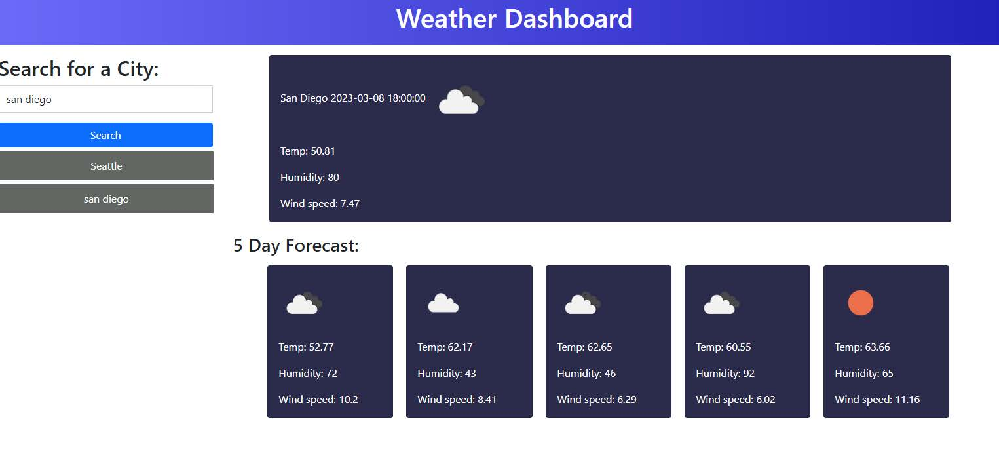

Description: The weather app has two major function. First a very easy and beneficial way to search for the weather forecast in various cities. Secondly to demonstrate my ability to call api data and return it in an organized and useful way. 

https://github.com/shane-pearson/weather-app

Deployed site: https://shane-pearson.github.io/weather-app/

Installation: First I had to build the late out of my website. I did this by working in bootstrap and CSS. I build a clean a simple header using CSS and adding a gradient. I used bootstrap to insert a search bar, and button. Finally I build multiple containers to house the information returned from the api. 

Usage: This app should be a quick way to search for weather. Save your results, and revisit in the future. 

Credits: I watched multiple tutorials to help with this project, and also refereed to class lessons. 